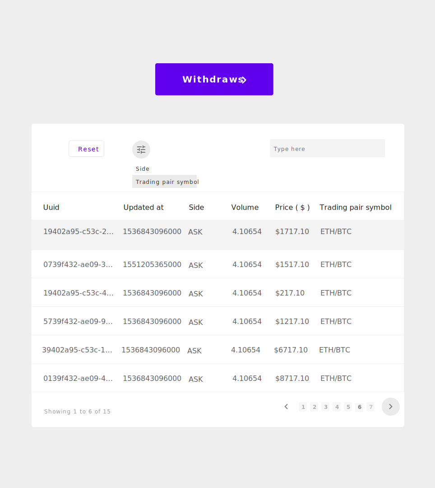

# Dynamic Table
A react web app that displays data from API dynamically on a table

### Instructions
<li> Click <a href="##">[ here ]</a> to see the live website</li> 

### Alternatively follow instructions to run locally
<code>Npm run</code>

### Markup design 
|          Trades            |          Withdraws            |
|----------------------------|-------------------------------|
|||

### Back-end Functionality
 

### Daily logs / Timestamp

| DAYS | Duration | Goals |
|------|------------------|-------------------------------------------------------------------------------------------------------------------------------------------------------------------------------------------------------------------------------------------------------------------------------------------------------------------------------------------------------------------------------------------------------------------------------------------------------------------------------------------------------------------------------------------------------------------------------------------------------------------------------------------------------------------------------------------------------------------------------------------------------------------------------------------------------------------------------------------------------------------------------------|
| 1 | 9:00pm - 11:30pm |
✔ Figure the best way to present your activity logs ✔ Research on how to make a grid table on Github Readme file ✔ Create a react app and get the environment ready for development ✔ Create a workspace on Adobe XD and getting it prepared for a markup design ✔ Email and ask the following questions:       - Can I use Bootstrap or any other CSS frameworks?       - How should a user navigate from /trades to /withdraws and vice versa? ✔ Go on Draw.io and make a workspace to draw a flow chart for the backend. ✘ Seek inspiration on the web about data tables and pick, one or 2 things on there most common styles. ✔ Make sure to go over the challenge description again for, better understanding. ✘ Ask more question beyond the two obvious ones. ✔ Spend some time trying to get this logs in order / Make, sure the presentation looks good |
| 2 | 2:00pm - 4:20pm --> 8:00pm - 10:00pm | ✔ Seek inspiration on the web about data tables and pick, one or 2 things on there most commonstyles. ✔ Make a markup design of the application / Complete it  ✘ Ask more questions i.e. :     - What is the implication of "(Use option from return body)"  ✘ Start coding --> aim to implement all the front-end visuals - "Don't worry about functionality at this moment." ✔ Make a basic back-end flow chart - give yourself an idea of how the system should flow / Process data. ✘ Do more research on react-redux / brush up on props, try to figure the best way to make the system consistently load HTTP request data. Consider using asynchronous function to get the job done. ✔ Take some time getting this documentation organised  |
| 3 | --------- |---------|
| 4  | 6:00pm - 9:20pm|✔Figure a way you could spawn the drop-down list options for filter ✔Implement search bar and make it search for items ✘Do a little more research on material UI, you need to better understand how to implement pagination  | |
| 5  | 8pm - 11pm |✔Finish the rest of flowchart for back-end structure ✔ Finish implementing the back-end of the app according to the flowchart ✔Make your own pagination and implement app everything according to markup | |
| 6  | 6pm - 9pm  |✔Update Readme file 
✔Add all the front-end visuals and make sure they're working i.e: <li>More styling on the search bar</li> <li>pop-up menu option on filters</li> <li>more styling on pagination</li> |  |
| 7  | 11:00am - 2:00pm -->  4:30pm - 9pm|✔Get pagination "next" and "prov" button working ✔Make the Reset button to work ✔Make it possible so you can search range  between ✔Finish and refine you documentation  ✔Write instruction on how you can write the application ✔Build the application 
| |
| Due| --------- | --------- |  |