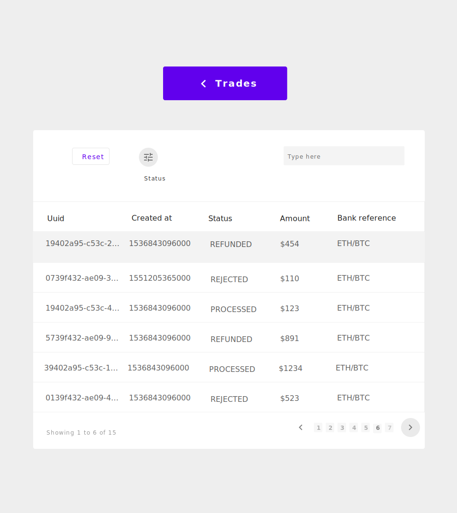

A react website that displays data dynamically on a table
## Code Test

## Instructions

--> Click [here] to view the application or 
<code>Npm install</code>

## Markup design 
|          Trades            |          Withdraws            |
|----------------------------|-------------------------------|
|||

## Back-end Functionallity
 

### Daily logs / Timestamp

| DAYS | Duration | Goals |
|------|------------------|-------------------------------------------------------------------------------------------------------------------------------------------------------------------------------------------------------------------------------------------------------------------------------------------------------------------------------------------------------------------------------------------------------------------------------------------------------------------------------------------------------------------------------------------------------------------------------------------------------------------------------------------------------------------------------------------------------------------------------------------------------------------------------------------------------------------------------------------------------------------------------------|
| 1 | 9:00pm - 11:30pm |
✔ Figure the best way to present your activity logs ✔ Researched on how to make a grid table on Github Readme file ✔ Create a react app and get the environment ready for development ✔ Create a workspace on Adobe XD and getting it prepared for a markup design ✔ Email and ask the following questions:       - Can I use Bootstrap or any other CSS frameworks?       - How should a user navigate from /trades to /withdraws and vice versa? ✔ Go on Draw.io and make a workspace to draw a flow chart on how for the backend of how the system will function. ✘ Seek inspiration on the web about data tables and pick, one or 2 things on there most common styles. ✔ Make sure to go over the challenge description again for, better understanding. ✘ Ask more question beyond the two obvious ones. ✔ Spend some time trying to get this logs in order / Make, sure the presentation looks good |
| 2 | 2:00pm - 4:20pm --> 8:00pm - 10:00pm | ✔ Seek inspiration on the web about data tables and pick, one or 2 things on there most commonstyles. ✔ Make a markup design of the application / Complete it  ✘ Ask more questions i.e. :     - What is the implication of "(Use option from return body)"  ✘ Start coding --> aim to implement all the front-end visuals - "Don't worry about functionality at this moment." ✔ Make a basic back-end flow chart - give yourself an idea of how the system should flow / Process data. ✘ Do more research on react-redux / brush up on props, try to figure the best way to make the system consistently load HTTP request data. Consider using asynchronous function to get the job done. ✔ Take some time getting this documentation organised  |
| 3 | --------- |  |

